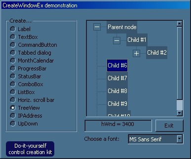



## Components\.\.\. without Project/Components

### Description

Here is a method to incorporate controls as the StatusBar, ProgressBar, TreeView, MonthCalendar and other "non-IDE-default" components, WITHOUT need to checking their libraries from Project/Components menu. A very convenient method to use a StatusBar without need of distributing the MSCOMCTL.
 
### More Info
 

             |
---                |---
**Submitted On**   |2003-03-19 19:25:16
**By**             |[Viktor E](https://github.com/Planet-Source-Code/PSCIndex/blob/master/ByAuthor/viktor-e.md)
**Level**          |Advanced
**User Rating**    |4.3 (26 globes from 6 users)
**Compatibility**  |VB 5\.0, VB 6\.0
**Category**       |[Windows API Call/ Explanation](https://github.com/Planet-Source-Code/PSCIndex/blob/master/ByCategory/windows-api-call-explanation__1-39.md)
**World**          |[Visual Basic](https://github.com/Planet-Source-Code/PSCIndex/blob/master/ByWorld/visual-basic.md)
**Archive File**   |[Components1562163202003\.zip](https://github.com/Planet-Source-Code/viktor-e-components-without-project-components__1-44127/archive/master.zip)

### API Declarations

CreateWindowEx

